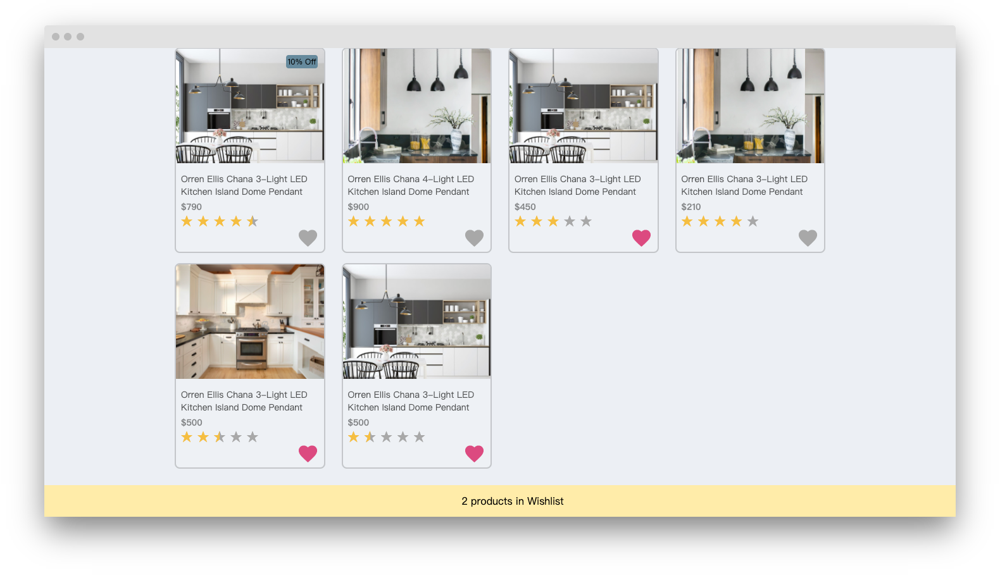

# Yahoo Product Listing



## Getting Started
1. Start running the code.
    ```
    cd yahoo-product-listing/
    npm install
    npm start
    ```
2. My App is now running at http://localhost:3000

## Building
```
npm run build
```
The static file will present in the `dist` folder.